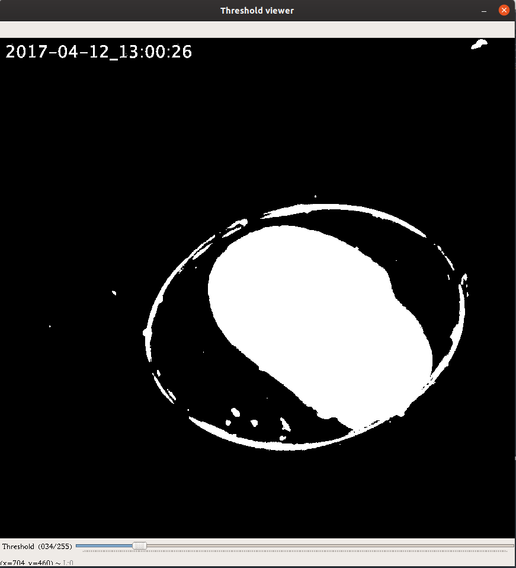
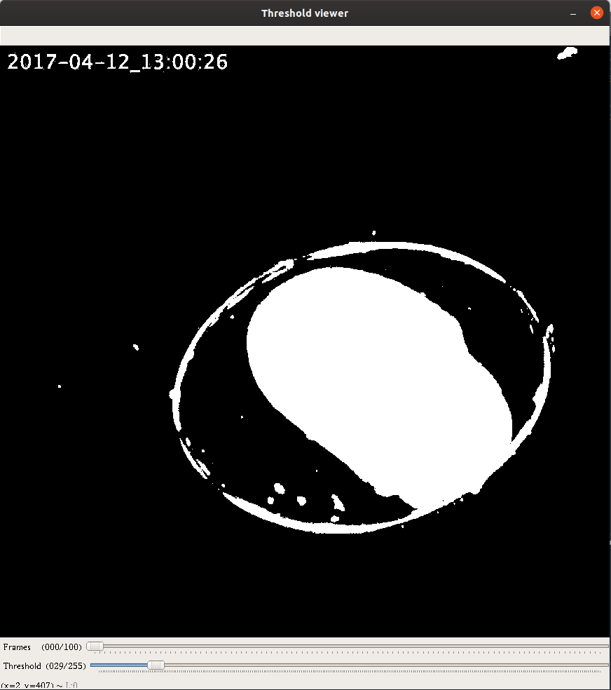
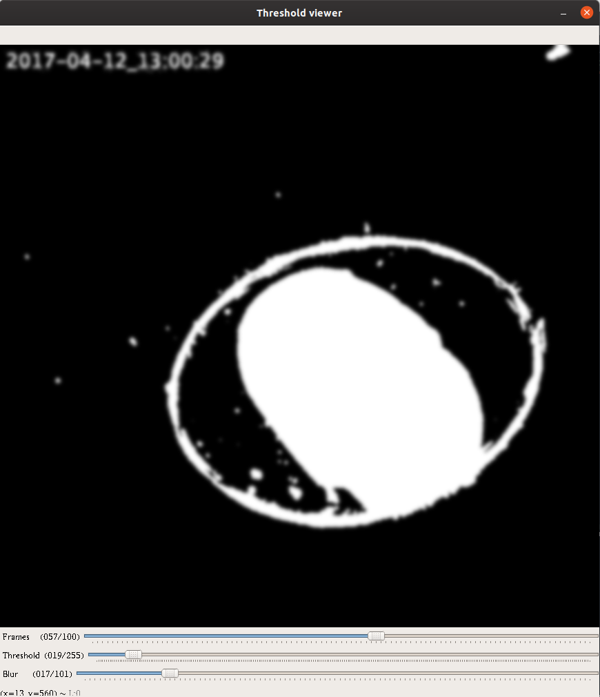

.. _creating-interfaces:

Creating interfaces
===================

Vuba provides a series of OpenCV HighGUI contructors for easily creating image analysis user interfaces. All of these contructors are based around the base constructor class: :py:class:`~vuba.BaseGUI`. This class provides a series of decorators that allow us to code up complex interfaces using simple, declarative code. 

Single trackbar interfaces
--------------------------

To demonstrate the ease of use of this module, let's first code up a simple binary threshold viewer containing a single trackbar. We will first need to grab some footage to work with:

.. code-block:: python

    import vuba
    import cv2

    # Create a handler for reading in the video
    video = vuba.Video("../examples/example_data/raw_video/test.avi")

    # Read in the first frame for the viewer
    first = video.read(index=0)

Now that we have some footage, we can go about creating our user interface. First, we will need to initiate an instance of :py:class:`~vuba.FrameGUI` since we are working with a single frame:

.. code-block:: python

    # Initiate an instance of FrameGUI
    gui = vuba.FrameGUI(first, "Threshold viewer")

Next we need to integrate our image processing function into the interface. Since we are only doing a binary threshold here this is relatively simple:

.. code-block:: python

    @gui.method
    def threshold(gui):
        frame = gui.frame.copy()  # create a copy of the current frame
        thresh_val = gui["thresh_val"]  # grab the current threshold value

        # Grayscale the current frame
        gray = vuba.gray(frame)

        # Threshold the current frame
        _, thresh = cv2.threshold(gray, thresh_val, 255, cv2.THRESH_BINARY)

        return thresh

Finally, we need to add a trackbar so that we can visualise the effects of varying our binary threshold:

.. code-block:: python

    @gui.trackbar("Threshold", id="thresh_val", min=0, max=255)
    def on_thresh(gui, val):
        gui["thresh_val"] = val
        img = gui.process()
        cv2.imshow(gui.title, img)

We're almost done, now all we need to do is run the gui we created:

.. code-block:: python

    gui.run()

The output of this code should give you the following gui:

This might seem trivial, but in less than 20 lines of code (excluding comments and whitespace) we have created a user interface that enables us to view the output of a variable binary threhsold. Note that because all gui constructors use the same base class, we only have to address the video constructor and supply an object that describes a video instead, to apply the interface to a movie:

.. code-block:: python

    # Initiate an instance of VideoGUI
    gui = vuba.VideoGUI(video, "Threshold viewer")

    @gui.method
    def threshold(gui):
        frame = gui.frame.copy()  # create a copy of the current frame
        thresh_val = gui["thresh_val"]  # grab the current threshold value

        # Grayscale the current frame
        gray = vuba.gray(frame)

        # Threshold the current frame
        _, thresh = cv2.threshold(gray, thresh_val, 255, cv2.THRESH_BINARY)
        return thresh

    @gui.trackbar("Threshold", id="thresh_val", min=0, max=255)
    def on_thresh(gui, val):
        gui["thresh_val"] = val
        img = gui.process()
        cv2.imshow(gui.title, img)

    # And finally execute the gui
    gui.run()

Multi-trackbar interfaces
-------------------------

To add additional trackbars to an interface, we only need to specify another trackbar using :py:meth:`BaseGUI.trackbar <vuba.BaseGUI.trackbar>` and add additional steps to our image processing method:

.. code-block:: python

    # Initiate an instance of VideoGUI
    gui = vuba.VideoGUI(video, "Threshold viewer")

    @gui.method
    def threshold(gui):
        frame = gui.frame.copy()  # create a copy of the current frame
        tb_vals = gui.values() # grab all current trackbar values

        # Grayscale the current frame
        gray = vuba.gray(frame)

        # Threshold the current frame
        _, thresh = cv2.threshold(gray, tb_vals['thresh_val'], 255, cv2.THRESH_BINARY)

        # Blur the thresholded image (note to exclude even values for actual applications)
        blur = cv2.GaussianBlur(thresh, (tb_vals['blur_val'],tb_vals['blur_val']), 0, 0)

        return blur

    # Add trackbars using the default callback
    gui.trackbar("Threshold", id="thresh_val", min=0, max=255)(None)
    gui.trackbar("Blur", id="blur_val", min=1, max=101)(None)

    # And finally execute the gui
    gui.run()

This should give us the following interface:

See also 
--------

For additional example scripts that cover usage of this module in more depth, see the following: 

- `examples/interfaces/binary_threshold_viewer.py`_
- `examples/interfaces/binary_threshold_viewer_with_drawing_camera.py`_
- `examples/interfaces/binary_threshold_viewer_with_drawing_video.py`_
- `examples/interfaces/frame_viewer.py`_
- `examples/image_operations/contour_filters_with_gui.py`_

.. _examples/interfaces/binary_threshold_viewer.py: https://github.com/EmbryoPhenomics/vuba/tree/main/examples/interfaces/binary_threshold_viewer.py

.. _examples/interfaces/binary_threshold_viewer_with_drawing_camera.py: https://github.com/EmbryoPhenomics/vuba/tree/main/examples/interfaces/binary_threshold_viewer_with_drawing_camera.py

.. _examples/interfaces/binary_threshold_viewer_with_drawing_video.py: https://github.com/EmbryoPhenomics/vuba/tree/main/examples/interfaces/binary_threshold_viewer_with_drawing_video.py

.. _examples/interfaces/frame_viewer.py: https://github.com/EmbryoPhenomics/vuba/tree/main/examples/interfaces/frame_viewer.py

.. _examples/image_operations/contour_filters_with_gui.py: https://github.com/EmbryoPhenomics/vuba/tree/main/examples/interfaces/contour_filters_with_gui.py
