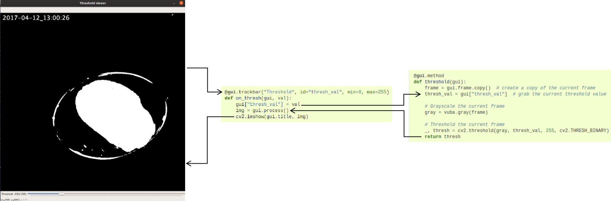

.. _interface-framework:

Vuba's interface framework
==========================

All of the HighGUI constructors that vuba provides are developed such that any application is centred around its image processing component, with UI components such as trackbars being secondary. As such, any changes made to a UI component will propagate back to the image processing component and the results will be visualised in the interactive window. Below we will cover this framework in-depth, and in subsequent guides walk you through how you may go about constructing some interfaces. 

Core UI components  
------------------

The current gui constructors are built around the base class :py:class:`vuba.BaseGUI`. This class allows one to construct user interfaces through two decorators: :py:meth:`BaseGUI.method <vuba.BaseGUI.method>` and :py:meth:`BaseGUI.trackbar <vuba.BaseGUI.trackbar>`. :py:meth:`BaseGUI.method <vuba.BaseGUI.method>` wraps the image processing components of user interfaces and :py:meth:`BaseGUI.trackbar <vuba.BaseGUI.trackbar>` enables the creation of trackbars. The recommended layout (disregarding additional steps/logic) for trackbar callbacks is as follows: trackbars should always set the current trackbar value for a gui instance (using :py:meth:`BaseGUI.__setitem__ <vuba.BaseGUI.__setitem__>`), call the declared image processing function (using :py:attr:`BaseGUI.process <vuba.BaseGUI.process>`) and then visualise the results in the interactive window (using ``cv2.imshow(gui.title, image)`` for e.g.). The simplest trackbar callback would carry out the aforementioned pipeline like follows: 

.. code-block:: python

	@gui.trackbar("Threshold", id="thresh_val", min=0, max=255)
	def on_thresh(gui, val):
	    gui["thresh_val"] = val # pull the current trackbar value
	    img = gui.process() # call the declared image processing function
	    cv2.imshow(gui.title, img) # visualise the result in the interactive window

This callback structure ensures that the image processing function is always called on each trackbar change and the results are returned to the interactive window, unless omitted by logic you supply. Note that this type of callback is supplied with :py:class:`vuba.BaseGUI` so that you don't have to code up the same callback for every trackbar. To use this built-in method simply call :py:meth:`BaseGUI.trackbar <vuba.BaseGUI.trackbar>` with ``None`` like follows:

.. code-block:: python

	gui.trackbar("Threshold", id="thresh_val", min=0, max=255)(None)

Similarly, the recommended layout for image processing callbacks using :py:meth:`BaseGUI.method <vuba.BaseGUI.method>` employs much of the same principles:

.. code-block:: python

	@gui.method
	def threshold(gui):
	    frame = gui.frame.copy()  # create a copy of the current frame
	    thresh_val = gui["thresh_val"]  # grab the current threshold value

	    gray = vuba.gray(frame) # grayscale the current frame
	    _, thresh = cv2.threshold(gray, thresh_val, 255, cv2.THRESH_BINARY) # threshold the current frame

	    # Return the output
	    return thresh

Here, we first pull the current frame stored in the interface instance (from :py:attr:`FrameGUI.frame <vuba.FrameGUI.frame>`) and the current trackbar(s) value (using :py:meth:`BaseGUI.__getitem__ <vuba.BaseGUI.__getitem__>`). We then pass these inputs to our image processing code (which is a simply binary threshold here) and then return the output to be visualised in the interactive window through our trackbar callbacks. In this sense, trackbar callbacks are the intermediate layer that communicate with the image processing and visualise the results in the interactive window:

Retrieving trackbar information
-------------------------------

:py:class:`vuba.BaseGUI` employs a dictionary interface for retrieving and assigning values associated with trackbars, primarily via :py:meth:`BaseGUI.__getitem__ <vuba.BaseGUI.__getitem__>` and :py:meth:`BaseGUI.__setitem__ <vuba.BaseGUI.__setitem__>` respectively. Here, the keys are the user-provided identification strings supplied to the ``id`` argument in :py:meth:`BaseGUI.trackbar <vuba.BaseGUI.trackbar>`. In addition to these two methods is :py:meth:`BaseGUI.values <vuba.BaseGUI.values>`. This methods retrieves all current trackbar values and is useful in applications which have multiple trackbars where repeated calls to :py:meth:`BaseGUI.__getitem__ <vuba.BaseGUI.__getitem__>` in :py:meth:`BaseGUI.method <vuba.BaseGUI.method>` would be too verbose. 

Key attributes
--------------

There are two main attribute types in the HighGUI constructors, those that contain information associated with UI components and those associated with the image processing component of the application. For the first type, there are the following:

- ``title``: character string corresponding to the title of the user interface created (specified at initiation).
- ``trackbars``: dictionary containing trackbar metadata. As mentioned above, keys correspond to the user-provided identifications strings given to :py:meth:`BaseGUI.trackbar <vuba.BaseGUI.trackbar>`. Each trackbars metadata is stored in a dataclass: :py:class:`vuba.TrackbarMethod`.

and for the second type, there are the following:

- ``process``: the image processing function supplied to :py:meth:`BaseGUI.method <vuba.BaseGUI.method>`.
- ``frame``: the current frame, which will not be changed for single frame interfaces (e.g. :py:class:`vuba.FrameGUI`) and will for multi-frame interfaces (e.g. :py:class:`vuba.FramesGUI`, :py:class:`vuba.VideoGUI` and :py:class:`vuba.StreamGUI`). 

Extensions for different footage types
--------------------------------------

Due to the diversity of footage a given set of image analyses can be applied to, we have written extensions of :py:class:`vuba.BaseGUI` to work with single frames (:py:class:`vuba.FrameGUI`), multiple in-memory frames (:py:class:`vuba.FramesGUI`), movies (:py:class:`vuba.VideoGUI`) and more recently, video feeds (:py:class:`vuba.StreamGUI`). Because all these constructors inherit :py:class:`vuba.BaseGUI`, they all share the same API and thus applying your image analyses to different footage formats often only consists of changing a couple lines of code (see :ref:`basic-interfaces`).
